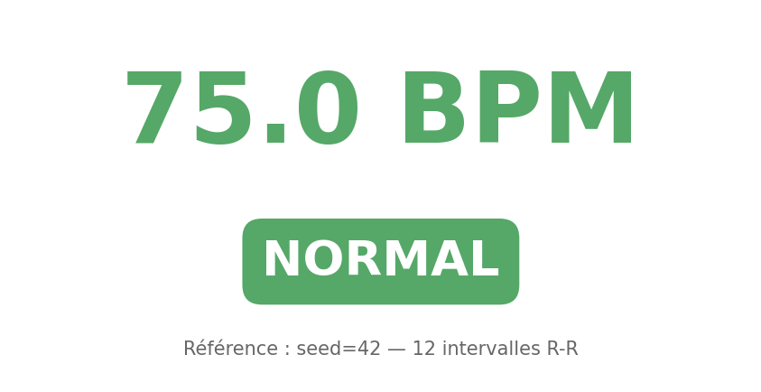
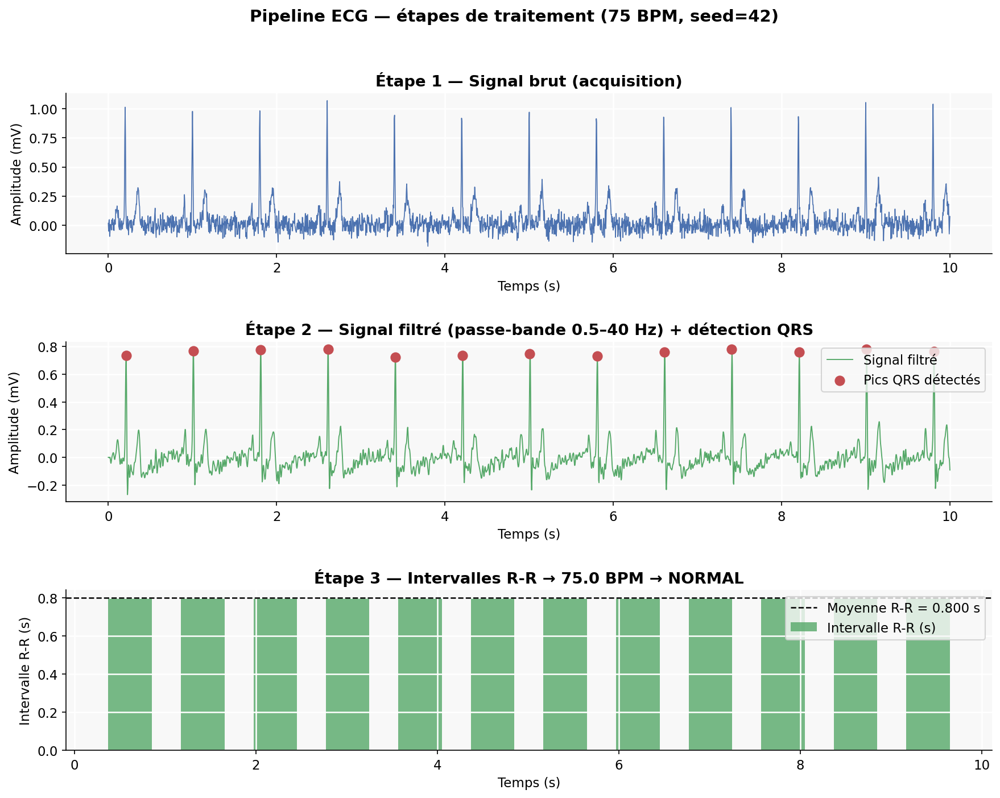
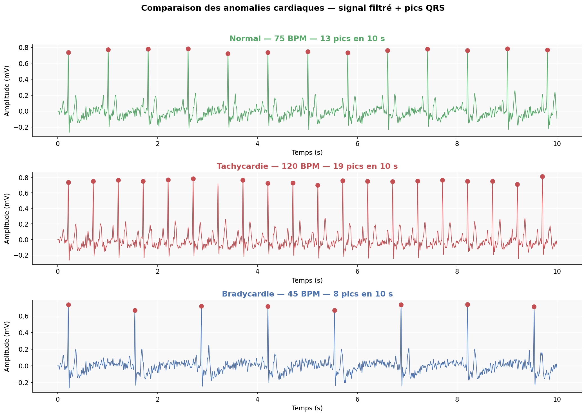

Visualisation du pipeline
=========================

Les figures ci-dessous montrent le signal ECG à chaque étape du traitement,
générées automatiquement avec ``seed=42`` et ``sample_rate=250 Hz``.

Résultat final (75 BPM)
------------------------

|

Étapes de traitement
---------------------

Le pipeline transforme le signal brut en trois étapes successives.

**Étape 1 — Signal brut**
  Le signal synthétique généré par ``SignalGenerator`` avec un rythme de 75 BPM.
  Il contient les ondes P, QRS et T ainsi qu'un bruit de fond gaussien.

**Étape 2 — Signal filtré + pics QRS**
  ``SignalProcessor`` applique un filtre passe-bande (0.5–40 Hz) qui élimine
  le bruit parasite. Ensuite ``find_peaks`` détecte les grandes pointes
  (complexes QRS), marquées en rouge.

**Étape 3 — Intervalles R-R → BPM → Diagnostic**
  ``HeartRateCalculator`` mesure le temps entre chaque pic (intervalle R-R).
  ``BPM = 60 / moyenne(R-R)``. ``AnomalyDetector`` classifie le résultat.

Comparaison des anomalies
--------------------------

Les trois scénarios cliniques testés par le pipeline, avec le même ``seed=42``.

.. list-table::
   :header-rows: 1
   :widths: 25 20 20 35

   * - Cas
     - BPM cible
     - Pics détectés
     - Diagnostic
   * - Normal
     - 75 BPM
     - ~13 pics / 10 s
     - NORMAL
   * - Tachycardie
     - 120 BPM
     - ~20 pics / 10 s
     - TACHYCARDIA
   * - Bradycardie
     - 45 BPM
     - ~8 pics / 10 s
     - BRADYCARDIA
